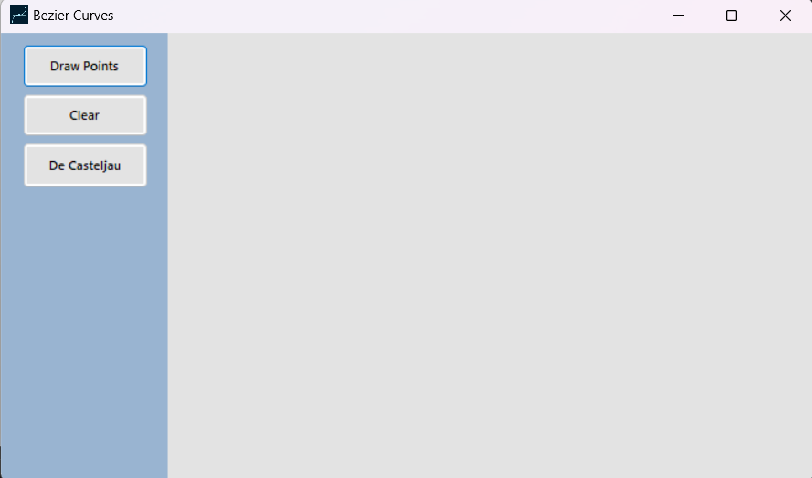
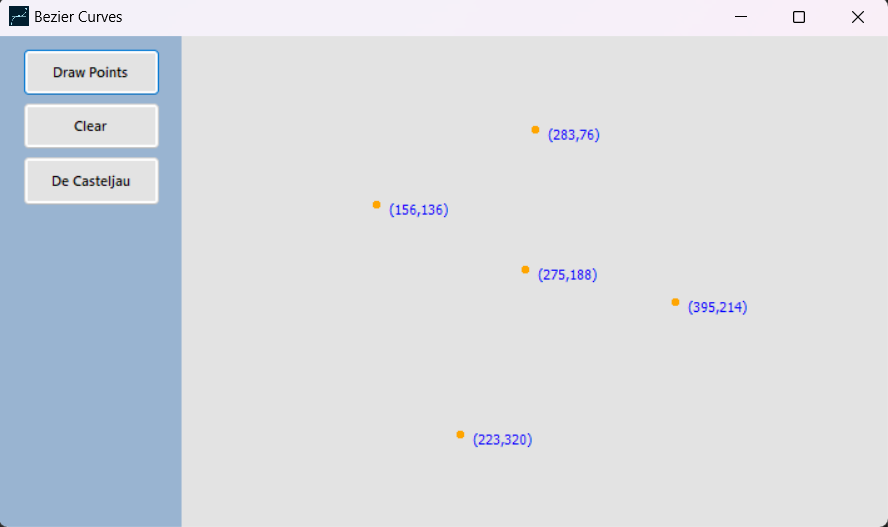
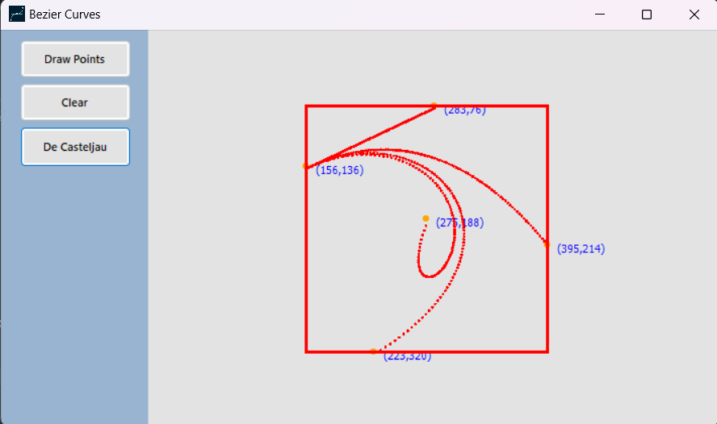

# Bezier Curve Drawer (WinForms C#)

A Windows Forms application in C# that renders Bézier curves and visualizes De Casteljau’s algorithm step by step. Built as an educational project for **BPG402 (Programming 2)** at the **Syrian Virtual University (SVU)**, it focuses on core computer graphics and object-oriented programming concepts.

---

## Overview

This app lets you place and manipulate control points, then draws the corresponding Bézier curve while showing the intermediate linear interpolations. The interface is simple and interactive, making the math behind Bézier curves intuitive and visual. It’s suitable for learning, demonstrations, and experimenting with curve behavior through direct manipulation.

---

## Features

- **Curve drawing:** Render Bézier curves from user-defined control points.
- **Interactive GUI:** Add, move, and delete control points via a Windows Forms canvas.
- **Algorithm visualization:** Step-by-step display of De Casteljau’s intermediate points and segments.
- **Education-first design:** Clean, commented code emphasizing OOP and graphics fundamentals.

---

## Requirements

- **IDE:** Visual Studio 2019 or newer.
- **Framework:** .NET Framework 4.7.2 or newer.
- **Language:** C# on Windows.

---

## Installation and Running

1. **Clone:**
   ```bash
   git clone https://github.com/MuaazHbobati/Bezier-Curve-Drawer-WinForms-CSharp.git

2. **Open:**
   Go to **File > Open > Project/Solution**, then select `Bezier_Curves.sln`.

3. **Build:**
   Restore NuGet packages if prompted, then **Build Solution** (`Ctrl+Shift+B`).

   4. **Run:**
   Press **Start** or `F5` to launch the application.

> If you encounter compatibility issues, ensure .NET Framework 4.7.2 (or newer) is installed.
> 
---

## Screenshots

- **Main UI:**

  
 

- **Control points:**

  
 

-  **Bezier curve rendering:**

   
 


---

## Usage

- **Add points:** Click on the drawing area to create new control points.
- **Move points:** Drag any control point to reshape the curve in real time.
- **Delete points:** Right-click a point to remove it, or use the provided control if available.
- **Show steps:** Enable “Show De Casteljau Steps” to reveal intermediate lines and points.
- **Precision:** Adjust sampling density or the step of \(t\) to control smoothness and performance.

---

## De Casteljau’s Algorithm

- **Linear interpolation between two points:**

  \[
  L(t) = (1 - t) \cdot P_0 + t \cdot P_1,\quad t \in [0,1]
  \]

- **Recursive construction:** Interpolate every adjacent pair of points to form a new set, then repeat on the reduced set until one point remains.

- **Curve point:** The final point after recursion is the curve point at the chosen \(t\). The method is numerically stable and visually intuitive, which is why it’s ideal for educational visualization.

---

## Project Structure

- **Solution:** `Bezier_Curves.sln` — open this in Visual Studio.
- **Source:** `Bezier_Curves/` — forms, logic, and resources.
- **Resources:** Icons and images (e.g., `Resources/Bezier icon for HW.ico`).
- **Docs:** Place your screenshots under `docs/images/` as referenced above.

---


## By Mohammad Muaaz Hbobati </>


---
